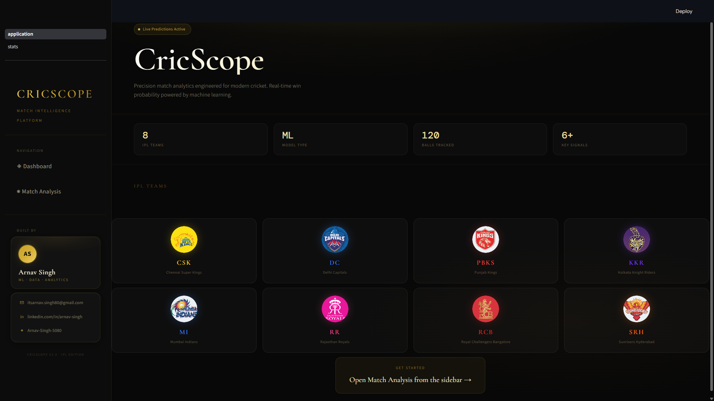
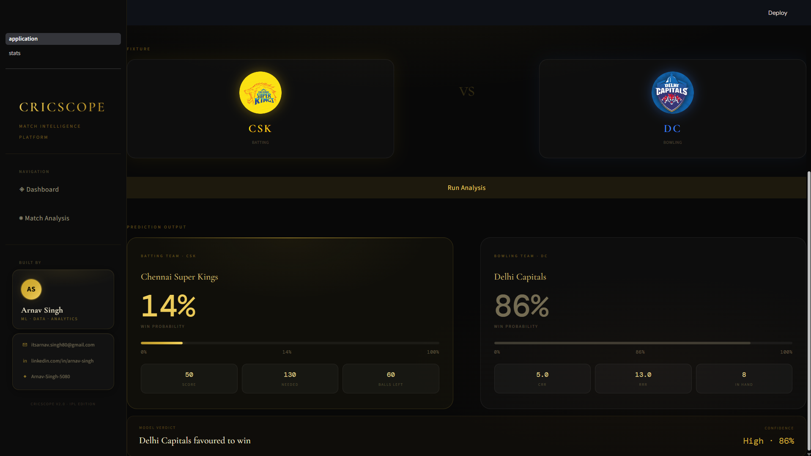
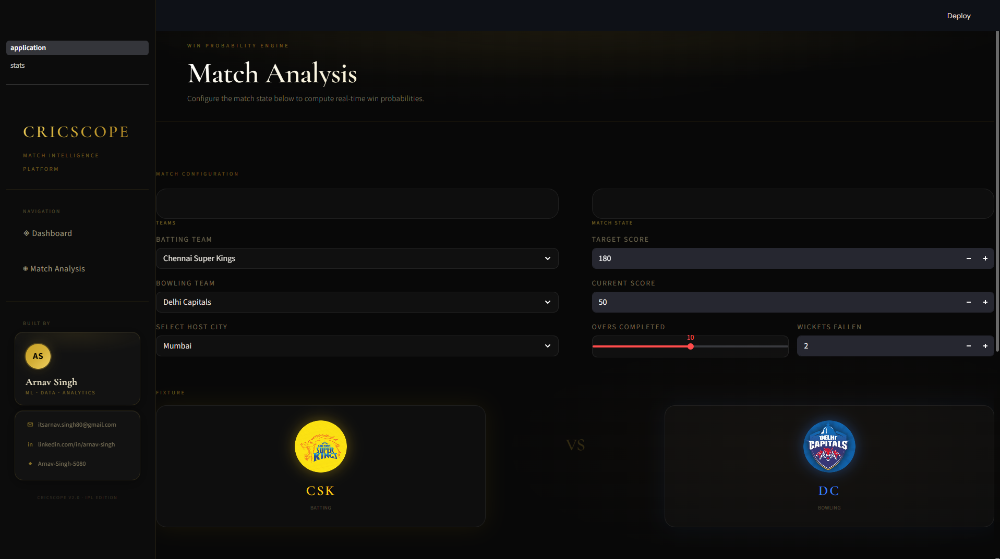

<div align="center">


<br/>


<br/><br/>


<br/>


<br/>


<br/><br/>

<a href="https://github.com/Arnav-Singh-5080/cricscope/stargazers">
  
</a>
&nbsp;
<a href="https://github.com/Arnav-Singh-5080/cricscope/network/members">
  
</a>
&nbsp;
<a href="https://github.com/Arnav-Singh-5080/cricscope/issues">
  
</a>

</div>

<br/>
<br/>

<div align="center">

## Live Demo

<a href="https://cricscope-live.streamlit.app/" target="_blank">
  
</a>

</div>

<br/>

---

<br/>

<div align="center">

## What is CricScope?

</div>

**CricScope** is a luxury-grade IPL match intelligence dashboard that computes real-time win probabilities using machine learning — trained on historical ball-by-ball delivery data spanning 2008–2020.

Built with a fintech-inspired dark UI featuring glassmorphism cards, gold gradients, and a premium serif + mono type system. Every design decision was intentional: this is not a student project — it's a production-grade sports analytics product.

> **GSSoC '26 & NSoC 2026 — Project Admin:** [Arnav Singh](https://github.com/Arnav-Singh-5080)

<br/>

---

<br/>

## Table of Contents 
- [Live Demo](#live-demo)
- [CricScope Documentation](#cricscope-documentation)
- [Architecture](#architecture)
- [Model Evaluation Metrics](#model-evaluation-metrics)
- [Dataset Split](#dataset-split)
- [Model Highlights](#model-highlights)
- [Tech Stack](#tech-stack)
- [Project Structure](#project-structure)
- [Screenshots](#screenshots)
- [Dashboard](#dashboard)
- [Win Probability Prediction Analytics Demo](#win-probability-prediction-analytics-demo)
- [Getting Started](#getting-started)
- [Prerequisites](#prerequisites)
- [Contribution Guidelines](#contribution-guidelines)
- [Security Policies](#security-policies)
- [Code of Conduct](#code-of-conduct)


## 📚 Documentation

- [Contributing Guidelines](CONTRIBUTING.md)
- [Security Policy](SECURITY.md)
- [Code of Conduct](CODE_OF_CONDUCT.md)
- [License](LICENSE)

<br/>

---

<br/>

<div align="center">

## Architecture

</div>

```text
┌─────────────────────────────────────────────────────────────────────┐
│                         CricScope Pipeline                         │
├─────────────────────────────────────────────────────────────────────┤
│                                                                     │
│   matches.csv ────┐                                                 │
│                   ├──► Merge on match_id ──► Filter: Inning 2       │
│   deliveries.csv ─┘                │                                │
│                                    │                                │
│                      ┌─────────────▼───────────────┐                │
│                      │      Feature Engineering      │               │
│                      │                               │               │
│                      │  current_score  (cumsum)      │               │
│                      │  runs_left      target-score  │               │
│                      │  balls_left     120-ball no.  │               │
│                      │  wickets        10-dismissed  │               │
│                      │  CRR            score/over    │               │
│                      │  RRR            runs*6/balls  │               │
│                      └─────────────┬───────────────┘                │
│                                    │                                │
│                      ┌─────────────▼───────────────┐                │
│                      │       Sklearn Pipeline        │               │
│                      │                               │               │
│                      │  ColumnTransformer            │               │
│                      │    OneHotEncoder              │               │
│                      │      batting_team             │               │
│                      │      bowling_team             │               │
│                      │      city                     │               │
│                      │    passthrough                │               │
│                      │      numeric features         │               │
│                      │                               │               │
│                      │  LogisticRegression           │               │
│                      │    max_iter = 1000            │               │
│                      └─────────────┬───────────────┘                │
│                                    │                                │
│                      ┌─────────────▼───────────────┐                │
│                      │ predict_proba() → [0, 1]    │                │
│                      │ Confidence: High/Mod/Close  │                │
│                      └─────────────────────────────┘                │
└─────────────────────────────────────────────────────────────────────┘
```


<div align="center">

##  Model Evaluation Metrics

</div>

The prediction engine uses a **Logistic Regression classifier**
trained on IPL ball-by-ball match data spanning IPL seasons from 2008–2020.

### Dataset Split

| Split Type | Ratio |
|---|---|
| Training Data | 80% |
| Testing Data | 20% |

---

### Model Highlights

- Real-time win probability prediction
- Ball-by-ball dynamic recalculation
- Match-state feature engineering
- OneHotEncoded categorical preprocessing
- Optimized scikit-learn pipeline
- Context-aware chase prediction logic

---

> Detailed evaluation metrics and expanded cross-validation results will be added in future model benchmarking updates.
<br/>

---

<br/>

<div align="center">

## Tech Stack


<br/><br/>

| Layer | Technology | Purpose |
|:------|:-----------|:--------|
| Frontend | Streamlit + Custom CSS | UI rendering & layout |
| Styling | Glassmorphism + Premium CSS | Luxury UI/UX |
| ML Pipeline | scikit-learn | Preprocessing + Logistic Regression |
| Data | Pandas + NumPy | Feature engineering |
| Deployment | Streamlit Cloud | Live hosting |

</div>

<br/>

---

<br/>

<div align="center">

## Project Structure

</div>


## Screenshots

### Dashboard



### Win Probability Prediction



### Analytics




## Demo


```bash
cricscope/
│
├── assets/
│   ├── dashboard.png
│   ├── prediction-page.png
│   ├── analytics.png
│   
├── app.py
├── matches.csv
├── deliveries.csv
├── requirements.txt
└── README.md
└── demo_.gif
```

<br/>

---

<br/>

<div align="center">

## Getting Started

</div>

### Prerequisites

- Python 3.9+
- IPL Dataset

Dataset:
https://www.kaggle.com/datasets/patrickb1912/ipl-complete-dataset-20082020

---

## 1 — Clone Repository

```bash
git clone https://github.com/Arnav-Singh-5080/cricscope.git
cd cricscope
```

---

## 2 — Create Virtual Environment

```bash
python -m venv venv

# Linux / macOS
source venv/bin/activate

# Windows
venv\Scripts\activate
```

---

## 3 — Install Dependencies

```bash
pip install -r requirements.txt
```

---

## 4 — Add Dataset

```text
cricscope/
├── app.py
├── matches.csv
└── deliveries.csv
```

---

## 5 — Run Application

```bash
streamlit run app.py
```

Visit:

```text
http://localhost:8501
```

<br/>

---

<br/>

<div align="center">

## Open Source Programs 2026


</div>

<br/>

CricScope is an officially selected project under:

- **GirlScript Summer of Code 2026 (GSSoC '26)**
- **Nexus Summer of Code 2026 (NSoC 2026)**

Contributors are evaluated on:

- Code quality
- UI consistency
- ML innovation
- Documentation quality
- Feature implementation

This repository welcomes:

- Beginners
- Open-source contributors
- UI/UX developers
- ML engineers
- Competitive programmers

<br/>

---

<br/>

<div align="center">

## Why Contribute?

</div>

- Beginner-friendly contribution environment
- Real-world ML engineering exposure
- Production-grade UI/UX experience
- Active mentoring & PR reviews
- Portfolio-worthy open-source project
- Industry-style collaboration workflow

<br/>

---

<br/>

<div align="center">

## Contribution Guide

</div>

### How to Contribute

```bash
# 1. Fork the repository

# 2. Clone your fork
git clone https://github.com/<your-username>/cricscope.git

# 3. Move into project
cd cricscope

# 4. Create feature branch
git checkout -b feature/your-feature-name

# 5. Make changes

# 6. Commit
git add .
git commit -m "feat: describe your changes"

# 7. Push
git push origin feature/your-feature-name

# 8. Open Pull Request
```

---

### Contribution Guidelines

- Maintain the premium dark luxury aesthetic
- Follow the existing project structure
- Keep pull requests focused
- Test locally before opening PR
- Write meaningful commit messages
- Respect UI consistency

---
## 🔐 Security Policy

Please review the [Security Policy](SECURITY.md) for vulnerability reporting guidelines and supported versions.

---

## 🤝 Code of Conduct

Please read our [Code of Conduct](CODE_OF_CONDUCT.md) before contributing to the project.


### Good First Issues

| Area | Task | Difficulty |
|:-----|:-----|:----------:|
| UI | Animated win probability graph | Medium |
| UI | Mobile responsiveness | Medium |
| UI | Team stat pills | Easy |
| ML | IPL 2021–2024 integration | Easy |
| ML | SHAP interaction visualizations | Medium |
| ML | Cross-validation metrics | Medium |
| Feature | Match report PDF export | Hard |
| Feature | Head-to-head analytics | Medium |
| Docs | Add screenshots & GIF demo | Easy |

<br/>

---

<br/>

<div align="center">

## Project Admin

### **Arnav Singh**

Project Admin — GSSoC '26 & NSoC 2026

<br/>

[](mailto:itsarnav.singh80@gmail.com)

&nbsp;

[](https://www.linkedin.com/in/arnav-singh-a87847351)

&nbsp;

[](https://github.com/Arnav-Singh-5080)

</div>

<br/>

---

<br/>


<div align="center">

## Support the Project

If this project helped you, consider giving it a ⭐ on GitHub.

It helps more contributors discover the project and motivates future development.

<br/><br/>


</div>
